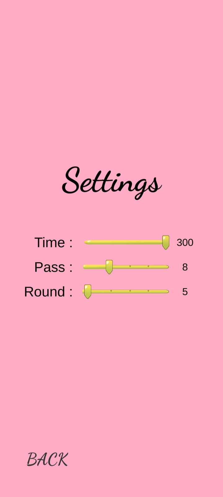
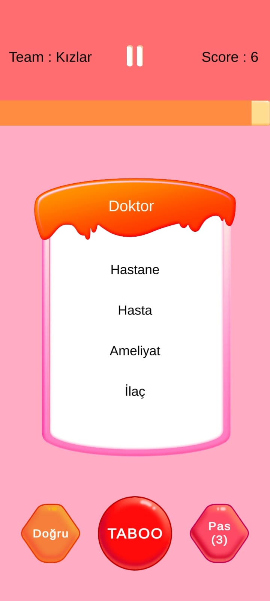

# Taboo Oyunu - Unity

Bu proje, Unity kullanılarak mobil cihazlar için geliştirilen bir **Taboo** oyunudur. Oyuncuların eğlenceli bir şekilde kelime tahmini yapmasını sağlayan bu oyun, arkadaş gruplarıyla keyifli vakit geçirmek için tasarlanmıştır.

## Özellikler

- **Kelime Listesi**: Oyunda kullanılmak üzere geniş bir kelime havuzu.
- **Takım Modu**: Oyuncuların iki takım halinde oynamasına olanak tanır.
- **Süreli Oyun**: Oyuncuların belirli bir süre içinde mümkün olduğunca fazla kelime tahmin etmesi gerekir.
- **Basit ve Şık Arayüz**: Kullanıcı dostu bir arayüz tasarımı.
- **Çoklu Dil Desteği**: Farklı dillerde kelime listeleri.

## Nasıl Oynanır?

1. Oyuncular iki takıma ayrılır.
2. Bir takım üyesi, diğer takım üyelerine belirli bir kelimeyi, yasaklı kelimeleri kullanmadan anlatmaya çalışır.
3. Belirli bir süre içinde mümkün olduğunca fazla kelime tahmin edilmeye çalışılır.
4. Her doğru tahmin için puan kazanılır.
5. Oyun sonunda en fazla puanı toplayan takım kazanır.

## Gereksinimler

- **Unity Sürümü**: 2021.3 veya üzeri
- **Platformlar**: Android ve iOS
- **Geliştirme Ortamı**: Unity Editor

## Kullanılan Teknolojiler

- **Unity Engine**: Oyun geliştirme.
- **C# Scriptleri**: Oyun mekaniği ve iş mantığı.
- **TextMeshPro**: Yazı tipleri ve metin yönetimi.
- **Unity UI**: Arayüz tasarımı.

## Görseller

## Lisans

Bu proje, [MIT Lisansı](LICENSE) kapsamında lisanslanmıştır.
